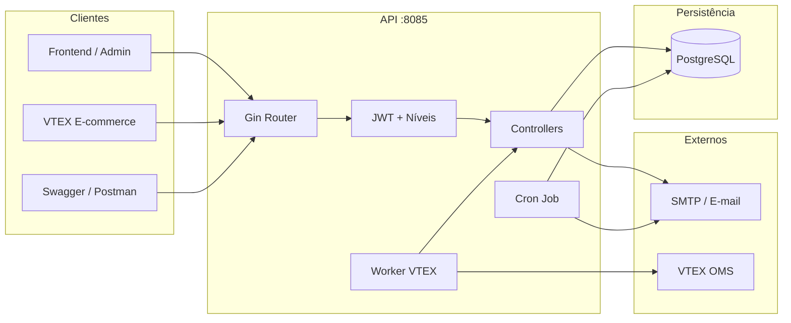

# CVE Pro — License Generator API

<p align="center">
  
  
  
  
  
</p>

<p align="center">
  <strong>API de geração e gestão de licenças de software</strong><br/>
  Códigos únicos · Notificações por e-mail · Integração VTEX · Controle de acesso por níveis
</p>

<p align="center">
  <a href="https://api-licenca.intelbras-cve-pro.com.br/swagger/index.html#/"><b>Documentação Swagger →</b></a>
</p>

---

## Visão geral

O **License Generator** é o backend responsável pelo ciclo de vida das licenças do ecossistema **CVE Pro**. Ele gera códigos únicos, gerencia chaves de ativação, autentica usuários com níveis de permissão, processa pedidos da VTEX via webhook e dispara e-mails automáticos na criação, proximidade de expiração e expiração das licenças.



---

## Funcionalidades

| Área | O que faz |
|------|-----------|
| **Licenças** | Gera códigos únicos (`36M-…` ou coringa `P3D-…`), com validade em meses, quantidade em lote e status (`Criada`, `Ativada`, `Expirada`, `Coringa`) |
| **Chaves** | Cria e gerencia chaves de ativação (`CVE-…`) vinculadas a nome, e-mail e CPF |
| **Autenticação** | Cadastro, login JWT, recuperação e redefinição de senha |
| **Níveis de acesso** | `superAdmin`, `admin`, `visualizador` e `pendente` (aguarda aprovação) |
| **E-mails** | Notifica criação, aviso de renovação (3 dias antes) e expiração |
| **Jobs** | Cron diário (01:00) verifica licenças ativadas e atualiza status |
| **VTEX** | Webhook de vendas enfileira pedidos e gera licenças automaticamente |
| **Auditoria** | Registra create / update / delete em licenças e chaves |
| **Swagger** | Documentação interativa pronta para exploração |

---

## Stack

- **Go 1.23** — runtime principal  
- **Gin** — HTTP, CORS e rotas  
- **GORM + PostgreSQL** — persistência e migrations automáticas  
- **golang-jwt** — autenticação Bearer  
- **robfig/cron** — agendamento de verificações  
- **go-simple-mail** — envio SMTP  
- **Swaggo** — OpenAPI / Swagger UI  
- **godotenv** — variáveis de ambiente em desenvolvimento  

---

## Início rápido

### Pré-requisitos

- Go **1.23+**
- PostgreSQL acessível
- Conta SMTP para envio de e-mails

### 1. Clone

```bash
git clone https://github.com/DhioneCastilhoBarbosa/license-generator.git
cd license-generator
```

### 2. Ambiente

```bash
cp .env.exemple .env
```

Edite o `.env` com as configurações do seu ambiente:

```env
# Autenticação
JWT_SECRET=sua_chave_secreta_forte
ENV=development

# Banco de dados (DSN do GORM / lib/pq)
DATABASE_DSN=host=localhost user=postgres password=senha dbname=licenses port=5432 sslmode=disable

# E-mail (SMTP)
EMAILUSER=seu@email.com
EMAILPASS=sua_senha_de_app

# Recuperação de senha
PASSWORD_RESET_URL=https://license.intelbras-cve-pro.com.br/auth/reset-password
PASSWORD_RESET_EXPIRY_MINUTES=60

# Integração VTEX (opcional, necessária para o webhook)
VTEX_APP_KEY=
VTEX_APP_TOKEN=
VTEX_WEBHOOK_SECRET=
```

### 3. Dependências e execução

```bash
go mod tidy
go run main.go
```

A API sobe em **`http://localhost:8085`**.

Em produção (`ENV=production`), o arquivo `.env` não é carregado — as variáveis devem vir do ambiente do host/container.

---

## Autenticação e níveis de acesso

Rotas protegidas exigem o header:

```http
Authorization: Bearer <token_jwt>
```

| Nível | Leitura | Escrita (licenças/chaves) | Gestão de usuários |
|-------|:-------:|:-------------------------:|:------------------:|
| `pendente` | — | — | — |
| `visualizador` | ✓ | — | — |
| `admin` | ✓ | ✓ | — |
| `superAdmin` | ✓ | ✓ | ✓ |

Novos cadastros entram como **`pendente`** até um `superAdmin` aprovar e definir o nível.

---

## Endpoints

### Públicos

| Método | Rota | Descrição |
|--------|------|-----------|
| `POST` | `/cadastrar-usuario` | Cadastro de usuário |
| `POST` | `/login` | Login e emissão de JWT |
| `POST` | `/solicitar-recuperacao-senha` | Envia link de reset |
| `POST` | `/redefinir-senha` | Redefine senha com token |
| `POST` | `/criar-chave` | Cria chave de ativação |
| `GET`  | `/recuperar-chave` | Recupera chave(s) |
| `POST` | `/webhook/vtex-vendas` | Webhook de pedidos VTEX |
| `GET`  | `/swagger/*any` | Documentação Swagger |

### Protegidos (JWT)

| Método | Rota | Quem pode | Descrição |
|--------|------|-----------|-----------|
| `GET` | `/licencas` | visualizador+ | Lista licenças |
| `GET` | `/chaves` | visualizador+ | Lista chaves |
| `GET` | `/buscar-chave` | visualizador+ | Busca chave |
| `POST` | `/criar-licenca` | admin+ | Cria licença(s) |
| `PUT` | `/atualizar-licenca` | admin+ | Atualiza status da licença |
| `DELETE` | `/deletar-licenca` | admin+ | Remove licença |
| `PUT` | `/atualizar-status-chave` | admin+ | Atualiza status da chave |
| `DELETE` | `/deletar-chave` | admin+ | Remove chave |
| `GET` | `/usuarios` | superAdmin | Lista usuários |
| `PUT` | `/usuarios/:id` | superAdmin | Atualiza nome/nível |
| `DELETE` | `/usuarios/:id` | superAdmin | Remove usuário |

> Collection Postman pronta em [`postman/Usuarios-Niveis-Acesso.postman_collection.json`](./postman/Usuarios-Niveis-Acesso.postman_collection.json) (`baseUrl` padrão: `http://localhost:8085`).

---

## Estrutura do projeto

```text
license-generator/
├── main.go                 # Bootstrap, CORS, rotas, cron e migrations
├── controllers/            # Handlers HTTP (licenças, chaves, users, webhook, reset)
├── models/                 # Entidades GORM e DTOs
├── middleware/             # JWT e autorização por nível
├── database/               # Conexão PostgreSQL
├── jobs/                   # Verificação de expiração de licenças
├── utils/                  # Geradores, e-mail, senha, HMAC, auditoria
├── docs/                   # Artefatos Swagger (swag)
├── postman/                # Collections de teste
├── arquitetura.excalidraw  # Diagrama de arquitetura
├── .env.exemple            # Template de variáveis
└── go.mod
```

---

## Ciclo de vida da licença

```text
Criada ──(ativação)──► Ativada ──(validade esgotada)──► Expirada
                          │
                          ├── 3 dias antes → e-mail de renovação
                          └── no vencimento → e-mail de expiração

Coringa (P3D-…) → sem ciclo de validade automático
TESTE            → modo acelerado para validação (minutos)
```

O job `VerificarLicencasExpiradas` roda todos os dias às **01:00**, ignora licenças coringa e processa as ativadas.

---

## Integração VTEX

1. A VTEX envia eventos para `POST /webhook/vtex-vendas`.
2. O pedido entra numa fila em memória.
3. O worker consulta o OMS (`intelbras.myvtex.com`) com `VTEX_APP_KEY` / `VTEX_APP_TOKEN`.
4. Com os dados do cliente e da compra, a API gera as licenças e notifica por e-mail.

A autenticação do webhook usa `VTEX_WEBHOOK_SECRET`.

---

## Documentação interativa

```text
Produção → https://api-licenca.intelbras-cve-pro.com.br/swagger/index.html
Local    → http://localhost:8085/swagger/index.html
```

Para regenerar a documentação após alterar anotações Swag:

```bash
swag init
```

---

## Scripts úteis

```bash
# Instalar / sincronizar dependências
go mod tidy

# Rodar a API
go run main.go

# Testes (ex.: utilitários de senha)
go test ./utils/
```

---

## Contribuição

Contribuições são bem-vindas.

1. Faça um fork e crie uma branch (`feat/…`, `fix/…`)
2. Commit com mensagens claras
3. Abra um Pull Request descrevendo o impacto

Issues e sugestões também ajudam a evoluir o projeto.

---

<p align="center">
  <sub>CVE Pro License API · Go · PostgreSQL · Gin</sub>
</p>
